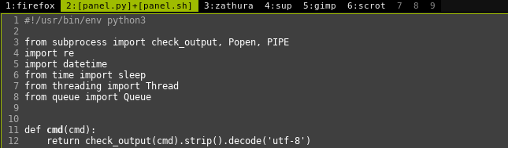
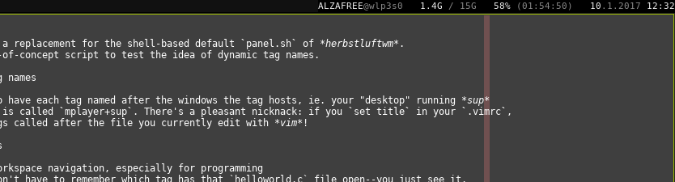

# panel.py

`panel.py` is a replacement for the shell-based default `panel.sh` of herbstluftwm.
It is a proof-of-concept script to test the idea of dynamic tag names.

## Main Advantages

### Dynamic tag names

The idea is to have each tag named after the windows the tag hosts, ie. your "desktop" running sup
and mplayer is called `mplayer+sup`. There's a pleasant nicknack: if you `set title` in your VIM
or NVIM config, you'll get tags called after the file you're currently editing!

Some benefits of this approach are apparent immediately:

  * **Simpler workspace navigation, especially for programming.** You don't have to remember which tag
    has that `helloworld.c` file open, you just see it.
  * **No need to give your tags fixed names in autostart or to pay attention where you open your windows.**
  * **Visual reminder of long running tasks and when they terminate.** So when you run `sudo pacman -Syu` in
    tag 6, the tag name is called `6:pacman` unless the upgrade is done. Or when you `cp -r` a lot of files,
    that `cp` will hang right there in the tag name as long as it's actually busy.
  * **Easy to extend to other apps.** You may alter the code to have your `inkscape` windows called after
    the open files.
    
### Modular architecture

Basically everything apart from the core panel functions itself are *widgets*. The class hierarchy was
carefully chosen to make it easy to add new simple widgets and to make it possible to add arbitrarily
complex ones.

### Batteries included

Comes with the following widgets (much more planned):

  * Clock (`ClockWidget`)
  * Memory usage (`MemoryWidget`)
  * Battery status (`BatteryWidget`, supports several batteries)
  * Herbstluft tags (`TagsWidget`)
  * Helpers to position things (`SpacerWidget` and `StretcherWidget`)

All widget codes (possibly with the exception of the tags widget) is trivial and easy to understand,
so if you miss a widget, you may easily roll your own.

### Easy to configure

To configure `panel.py` you only have to edit a single Python source file (called `run.py`), which does
all the configuration. Voilá.

See Configuration below.


## Configuration

Simple. Maybe *byte* too simple at the moment. Look at `run.py`:

```python

tags = TagsWidget(panel)
clock = ClockWidget(panel, '<normal>{t.day}<inactive>.{t.month}.{t.year} <normal>{t.hour:02d}:{t.minute:02d}')
mem = MemoryWidget(panel, '<normal>{used} <inactive>({available})')
battery = BatteryWidget(panel, '<normal>{b[0][percent]} <inactive>({b[0][time]})')
hello_world = TextWidget(panel, "<inactive>This is a <normal>very cocky<inactive> panel.py")
stretcher = StretcherWidget(panel)
spacer = SpacerWidget(panel, 15)

panel.register(tags)
panel.register(stretcher)
panel.register(hello_world)
panel.register(stretcher)
panel.register(mem)
panel.register(spacer)
panel.register(battery)
panel.register(spacer)
panel.register(clock)

panel.start()
```

How hard's that, huh? Those `<style-name>` tags are human-writable formatting markup (as opposed to the
dzen2 markup, which is human-incompatible). The basic styles `normal`, `active`, `inactive` and `urgent`
will always be defined automatically.

## Project status

This is a new thing, so:

  * No multiple screens support
  * Code needs a bit of refactoring
  * You may run into pecularities if your overall workspace setup is different from mine
  * All suggestions and contributions are welcome
  * **... but it's still worth trying out!**
  
## Screenshots

<p align="center">
	
	
</p>
