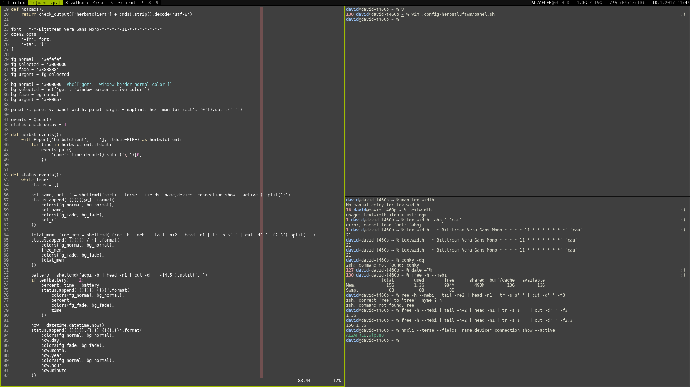

# panel.py

`panel.py` is a replacement for the shell-based default `panel.sh` of *herbstluftwm*.
It is a proof-of-concept script to test the idea of dynamic tag names.

## Dynamic tag names

The idea is to have each tag named after the windows the tag hosts, ie. your "desktop" running *sup*
and *mplayer* is called `mplayer+sup`. There's a pleasant nicknack: if you `set title` in your `.vimrc`,
you'll get tags called after the file you currently edit with *vim*!

### Advantages

  * Simpler workspace navigation, especially for programming
      * You don't have to remember which tag has that `helloworld.c` file open--you just see it.
  * Visual reminder of long running tasks and when they terminate
      * So when you run `sudo pacman -Syu` in tag 6, the tag name is called `pacman` unless the upgrade is done
      * Or when you `cp -r` a lot of files, that `cp` will hang there as long as it's actually busy
  * Easy-to-modify code: support different behaviour for different apps
      * You may alter the code to have your `inkscape` windows called after the open files

## Project status

This is a new thing, so:

  * No multiple screens support
  * Code needs refactoring
  * Need to change code to customize status text
  * All suggestions and contributions welcome
  * You may run into pecularities if your overall workspace setup is different from mine
  * **... but still worth trying out!**
  
## Screenshots

